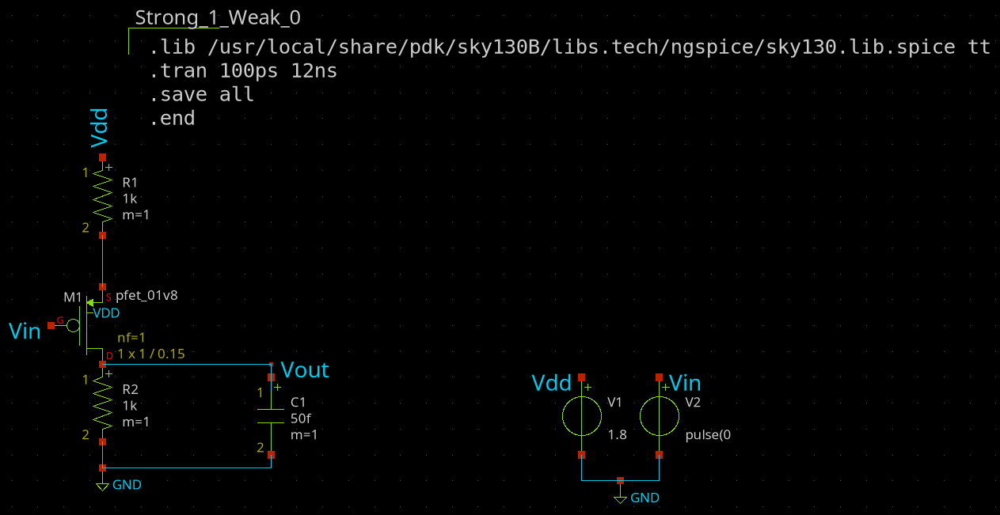

# Schematic and Layout Design of CMOS Inverter Using SKY130 pdk
Welcome to the **CMOS Inverter Design** project using the open-source **SKY130 PDK**!  
This repository showcases the complete workflow for designing, simulating, and (soon) laying out a CMOS inverter, leveraging a suite of powerful open-source EDA tools.

The design is done using the standard `1.8V nfet and pfet` from the `sky130B` library .

## 🛠️ Tools Overview

| Tool        | Purpose                        | Status              |
|-------------|-------------------------------|---------------------|
| **Xschem**      | Schematic design              | ✅ Completed           |
| **Ngspice**     | SPICE simulations             | ✅ Completed           |
| **Magic VLSI**  | Layout design                 | ⏳ To be done          |
| **Netgen**      | Layout vs Schematic (LVS)     | ⏳ To be done          |

Stay tuned as I continue to build and verify the layout in upcoming updates!

## 📚 Getting Started

To get started with the project, follow these steps:
1. **Clone the repository**:
   ```bash
   git clone https://github.com/Krishanu-007/cmos_inverter_sky130.git
   cd cmos_inverter_sky130
   ```
2. **Install the required tools**:
   - Ensure you have the latest versions of Xschem, Ngspice, Magic VLSI, and Netgen installed on your system.
   - Refer to the another repository for installation instructions: [transistor_analysis_sky130](https://github.com/Krishanu-007/transistor_analysis_sky130).
3. **Open the schematic**:  
   - Launch Xschem and open the `inv.sch` file located in the `Xschem` directory. This file contains the schematic of the CMOS inverter.
   - You can view the symbolic representation of the inverter by opening the `inv.sym` file in the same directory.
   - The resulting test bench schematic is available in the `inv_test.sch` file.
4. **Run simulations**:
   - first, ensure Ngspice is installed and configured correctly.
   - On the schematic editor press `shift+a` to activate the netlist viewer
   - Click on `Netlist` Icon then save the netlist, I have saved it in the `Simulation` directory with the corresponding name i.e. `inv_test` folder.
   - As the simulation is done you can view the results by following the necessary steps in Ngspice.
5. **Layout and LVS (future work)**:
   - The layout design is to be done in future. Once completed, the layout will be able to open in Magic VLSI.
    - After the layout is created, you can run LVS using Netgen to verify that the layout matches the schematic.

----
There are reasons why we use PMOS and NMOS transistors. PMOS is used for transmitting `Strong '1's`, while NMOS is used for transmitting `Strong '0's`. This has been shown in the below section
### *Strong '0's and Weak '1's*:
In the below figure, the NMOS transistor is used to transmit both '0'(LOW) and '1'(HIGH) signals. As it can be seen that for '0' signal, the NMOS transistor is fully on, allowing a strong '0' to be transmitted. However, '1' signal the out response is not what is expected. You can see that, when a square wave is applied to the input of NMOS, when it is `LOW(0V)`, the output goes to `HIGH(1.8V)`. But when the input is `HIGH(1.8V)`, the output goes to a value that is much `larger than 0V`. This is due to the fact that when `Vgs is 1.8V`, the NMOS is in `linear region`. This is where the MOSFET acts as a voltage controlled resistor. At this point, the output is connected to a Voltage Divider Configuration. That is the output takes the value which is defined by the voltage across the resistance of the mosfet. Hence, NMOS is able to transmit Strong '0', but not a Strong '1'.


### *Strong '1's and Weak '0's*:
The same explanation applies for PMOS, with the necessary changes. The test schematic and graph are shown below:




----


## **CMOS Inverter Design and Analysis**:

### Why CMOS circuits?

 An interesting obseration was made in the previous section, where we realised that neither NMOS nor PMOS can be used for design that can produce either values, HIGH and LOW. But another thing that is worth notice is how they complement each other. This is what gave rise to an idea of attaching them together. Since, PMOS is a Strong 1, we put it between VDD and Vout and NMOS being a STRONG 0, it is placed between Vout and GND. This way, either can act as a load to the other transistor, since both are never ON together (Are they?). The configuration looks like what we have below. This is referred to as Complimentary Metal Oxide Semiconductor(CMOS) Configuration and it also represents the simplest circuit known as the CMOS Inverter.


CMOS Circuits generally consists of a network split into two parts, Upper one referred to as a pull up network and the lower half as a pull down network. The former consists of P-channel MOSFETs and later N-Channel MOSFETs. Reason is simple. As one transistor is one, another is off. This eliminates the issue of an resistive path to the ground and hence, no voltage division occurs(At least not a significant one). This way, one can easily achieve a Strong High and a Strong LOW from the same network. PULL UP is what offers a low resistance path to the VDD and PULL DOWN is what offers a low resistance path the GND.

### CMOS Inverter Pre-Layout Analysis:
Before, I start with the CMOS inverter, I believe it is worth mentioning what an Inverter is. Inverter is something that inverts. In electronics it is very popularly explained as something that performs the NOT logic, that is complements the input. So a HIGH(1.8V) becomes LOW(0V) and vice versa. Ideally, the output follows the input and there is no delay or propogation issues of the circuit. But in reality, an inverter can be a real piece of work. It can have serveral isseus like how fast can it react to the changes in the input, how much load can it tolerate before it's output breaks and so many more including noise, bandwidth, etc.

All these parameters are what will always plague any analog design or design with transistor in general. Hence, with inverter many like to explore them all. So it justifies why Inverter is referred to as Hello World! of transistor level design. Atleast, I say that 🤣. So in this section that took me aeons to reach to, we finally start with all the important analysis and parameters to be evaluated for an Inverter. I first start with a schematic diagram, then I evaluate all the parameters, that is, measuring them, experimenting with them and reaching a conclusive value and Finally reach a schematic circuit that is capable of things we lay down at the beginning.

The analysis starts with designing of the `inverter schematic` after which I have have converted it into a `symbol` such that it can be used for my future projects. Initially the **(W/L)** ratio of the PUN and PDN is not changed(kept the standard value) and is used for the simulations, results of which are shown below:

#### Schematic and Symbol:
The internal schematic:


The custom symbol created:


#### Simulation result from the above:

The test bench created to test the inverter:


The graph obtained:


Zoomed version:


Value of Vth: 


As it can be seen that the Vth obtained is not exactly what is expected, this is because of the ratio that is used here. This **(W/L)** ratio is also called `aspect ratio` and from now on I am going to use **S** for referring it.

The **S** value for the inverter is to be adjusted such that the Vth obtained can be exactly near the mid point .i.e. `0.9V`. However it is to be taken into consideration the penalty of size. From the above obtained VTC graph the sizing of the tranistors can be done by keeping following this trend:


#### Optimised Version:

In this version I have increased the aspect-ratio of the PMOS by 2.5 times of that of the NMOS.
That is `(W/L) ratio of PMOS = (W/L) ratio of NMOS` where the `(W/L) ratio of NMOS is kept at 1/0.15 microns`

**Schematic :**

The modified schematic


**Simulation Result from the above:**

The test bench created to test the inverter:


The graph obtained:


Zoomed version:


Value of Vth: 


**AS OF NOW THIS MUCH HAS BEEN DONE, WILL BE UPDATING IT ON DAILY BASIS** 
