# Design and analysis of CMOS inverter using Sky130 pdk


Welcome to the **CMOS Inverter Design** project using the open-source **SKY130 PDK**!  

This repository showcases the complete workflow for designing, simulating, and (soon) laying out a CMOS inverter along with a detailed pre-layout and post-layput analysis.

The entire operation is done by using the standard `1.8v nfet` and `1.8v pfet`. However I have used the latest iteration of the pdk `sky130B` for the entire project.


## 📚 Contents

| Section | Description |
|--------|-------------|
| [Introduction](#design-and-analysis-of-cmos-inverter-using-sky130-pdk) | Overview of the project |
| [Progress](#progress) | Current status of the design |
| [Getting Started](#getting-started) | How to set up tools and run simulations |
| [Pre-Layout Analysis](#pre-layout-analysis) | Testing NMOS and PMOS individually |
| [CMOS Inverter Design](#cmos-inverter-design) | Concept, schematic, and operation |
| [CMOS VTC Analysis](#cmos-vtc-analysis) | Transfer characteristics and sizing |
| [CMOS Noise Analysis](#cmos-noise-analysis) | Noise margins and gain curve |
| [CMOS Delay Analysis](#cmos-delay-analysis) | Propagation delay, rise/fall time |
| [CMOS Power Analysis](#cmos-power-analysis) | Dynamic, short-circuit, and static power |
| [Summary](#summary-of-the-designed-inverter-from-pre-layout-analysis) | Consolidated results table |


## Progress 

| Jobs             | Status                                                                |
| ----------------- | ------------------------------------------------------------------ |
| Transistor Analysis| ✅ Completed   |
| Schematic Design | ✅ Completed   |
| Layout Design | ⏳ To be done |
| Layout vs Schematic(LVS) | ⏳ To be done |


## Getting Started

To get a hands-on on this project:

```bash
  git clone https://github.com/Krishanu-007/cmos_inverter_sky130.git
  cd cmos_inverter_sky130
```
Ensure to have all the necessary tools:
```bash
 Xschem
 Ngspice
 Magic VLSI
 Netgen
 ```
 To install all the tools please refer to my another repository named: [transistor_analysis_sky130](https://github.com/Krishanu-007/transistor_analysis_sky130)

**Open the schematic**:  
- Launch Xschem and open the `inv.sch` file located in the `Xschem` directory. This file contains the schematic of the CMOS inverter.
- You can view the symbolic representation of the inverter by opening the `inv.sym` file in the same directory.
- The resulting test bench schematic is available in the `inv_test.sch` file.

**Run simulations**:
- first, ensure Ngspice is installed and configured correctly.
- On the schematic editor press `shift+a` to activate the netlist viewer
- Click on `Netlist` Icon then save the netlist, I have saved it in the `Simulation` directory with the corresponding name i.e. `inv_test` folder.
- As the simulation is done you can view the results by following the necessary steps in Ngspice.

**Layout and LVS (future work)**:
- The layout design is to be done in future. Once completed, the layout will be able to open in Magic VLSI.
- After the layout is created, you can run LVS using Netgen to verify that the layout matches the schematic.

I have created a seperate schematic for every analysis and test, however the basic circuit remains the same .i.e. `inv.sym`


## Pre-Layout Analysis

The starting of the pre-layout analysis starts by testing the feasibility of signal transmission by both mosfets- `nfet` and `pfet`. These are the basics that are needed.

### *Strong '0's and Weak '1's*:
In the below figure, the NMOS transistor is used to transmit both '0'(LOW) and '1'(HIGH) signals. As it can be seen that for '0' signal, the NMOS transistor is fully on, allowing a strong '0' to be transmitted. However, '1' signal the out response is not what is expected. You can see that, when a square wave is applied to the input of NMOS, when it is `LOW(0V)`, the output goes to `HIGH(1.8V)`. But when the input is `HIGH(1.8V)`, the output goes to a value that is much `larger than 0V`. This is due to the fact that when `Vgs is 1.8V`, the NMOS is in `linear region`. This is where the MOSFET acts as a voltage controlled resistor. At this point, the output is connected to a Voltage Divider Configuration. That is the output takes the value which is defined by the voltage across the resistance of the mosfet. Hence, NMOS is able to transmit Strong '0', but not a Strong '1'.

**Schematic**:
<p align="center">
  
</p>

**Sim_Window and Sim_Graph**:

<p align="center">
  
  
</p>

### *Strong '1's and Weak '0's*:
The same explanation applies for PMOS, with the necessary changes. The test schematic and graph are shown below:

**Schematic**:

<p align="center">
  
</p>

**Sim_Window and Sim_Graph**:
<p align="center">
  
  
</p>

## CMOS Inverter Design

### Why CMOS circuits?

 An interesting obseration was made in the previous section, where we realised that neither NMOS nor PMOS can be used for design that can produce either values, HIGH and LOW. But another thing that is worth notice is how they complement each other. This is what gave rise to an idea of attaching them together. Since, PMOS is a Strong 1, we put it between VDD and Vout and NMOS being a STRONG 0, it is placed between Vout and GND. This way, either can act as a load to the other transistor, since both are never ON together (Are they?). The configuration looks like what we have below. This is referred to as Complimentary Metal Oxide Semiconductor(CMOS) Configuration and it also represents the simplest circuit known as the CMOS Inverter.

 CMOS Circuits generally consists of a network split into two parts, Upper one referred to as a pull up network and the lower half as a pull down network. The former consists of P-channel MOSFETs and later N-Channel MOSFETs. Reason is simple. As one transistor is one, another is off. This eliminates the issue of an resistive path to the ground and hence, no voltage division occurs(At least not a significant one). This way, one can easily achieve a Strong High and a Strong LOW from the same network. PULL UP is what offers a low resistance path to the VDD and PULL DOWN is what offers a low resistance path the GND.

 **CMOS Network**:

 <p align="center">
  
</p>

### Idea of Inverter:
Before, I start with the CMOS inverter, I believe it is worth mentioning what an Inverter is. Inverter is something that inverts. In electronics it is very popularly explained as something that performs the NOT logic, that is complements the input. So a HIGH(1.8V) becomes LOW(0V) and vice versa. Ideally, the output follows the input and there is no delay or propogation issues of the circuit. But in reality, an inverter can be a real piece of work. It can have serveral issues like how fast can it react to the changes in the input, how much load can it tolerate before it's output breaks and so many more including noise, bandwidth, etc.

All these parameters are what will always plague any analog design or design with transistor in general. Hence, with inverter many like to explore them all. So it justifies why Inverter is referred to as Hello World! of transistor level design. Atleast, I say that 🤣. So in this section that took me aeons to reach to, we finally start with all the important analysis and parameters to be evaluated for an Inverter. I first start with a schematic diagram, then I evaluate all the parameters, that is, measuring them, experimenting with them and reaching a conclusive value and Finally reach a schematic circuit that is capable of things we lay down at the beginning.


**NOT(Inverter) Gate**:

<p align="center">
  
</p>

----
### CMOS VTC analysis:

**VTC** is a plot of **output voltage (Vout)** vs **input voltage (Vin)** for a CMOS inverter.

#### Key Regions:
- **Vin ≈ 0V** → PMOS ON, NMOS OFF → **Vout ≈ VDD**
- **Vin ≈ Vth** → Both ON → **Vout drops sharply**
- **Vin ≈ VDD** → NMOS ON, PMOS OFF → **Vout ≈ 0V**

#### Why VTC Matters:
- Shows inverter switching behavior
- Helps determine **Vth** (threshold voltage)
- Used to evaluate **noise margins** and **transistor sizing**


<p align="center">
  
</p>


The analysis starts with designing of the `inverter schematic` after which I have have converted it into a `symbol` such that it can be used for my future projects. Initially the **(W/L)** ratio of the PUN and PDN is not changed(kept the standard value) and is used for the simulations, results of which are shown below:

#### Schematic and Symbol:
The internal schematic:

<p align="center">
  
</p>

The custom symbol created:

<p align="center">
  
</p>

#### Simulation result from the above:

The test bench created to test the inverter:

<p align="center">
  
</p>

The graph obtained (left) and zoomed version (right):

<p align="center">
  
  
</p>

Value of Vth:

<p align="center">
  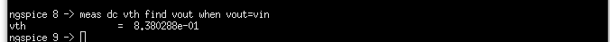
</p>

As it can be seen that the Vth obtained is not exactly what is expected, this is because of the ratio that is used here. This **(W/L)** ratio is also called `aspect ratio` and from now on I am going to use **S** for referring it.

The **S** value for the inverter is to be adjusted such that the Vth obtained can be exactly near the mid point i.e. `0.9V`. However, it is to be taken into consideration the penalty of size. From the above obtained VTC graph, the sizing of the transistors can be done by following this trend:

<p align="center">
  
</p>


#### Optimised Version:

In this version, I have increased the aspect ratio of the PMOS by 2.5 times that of the NMOS.  
That is:  
`(W/L) ratio of PMOS = 2.5 × (W/L) ratio of NMOS`,where the `(W/L)` ratio of NMOS is kept at `1/0.15 microns`.


**Schematic:**

<p align="center">
  
</p>


**Simulation Result from the above:**

Test bench used for simulation:

<p align="center">
  
</p>

Graph obtained (left) and zoomed version (right):

<p align="center">
  
  
</p>

Value of Vth:

<p align="center">
  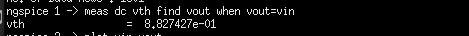
</p>


Hence the finalised `threshold voltage` of the inverter is `0.88v`. As it can be seen that the value is not exactly half of the `Vdd` .i.e `0.9V`. This is because of the sizing limitations that I have applied(in terms of aspect ratios).

---
### CMOS Noise Analysis

**Noise Analysis** determines how much unwanted signal variation (noise) a CMOS logic gate can tolerate without malfunctioning.

#### Key Terms:

- **VIL**: Max input voltage still read as logic LOW  
- **VIH**: Min input voltage still read as logic HIGH  
- **VOL**: Max output voltage for logic LOW  
- **VOH**: Min output voltage for logic HIGH  

#### Noise Margins:

- **Noise Margin Low (NML)**  
  `= VIL − VOL`

- **Noise Margin High (NMH)**  
  `= VOH − VIH`

These define how much noise can be added to a signal without changing its logic value.

#### Why Noise Analysis Matters:

- Ensures **reliable logic level detection**
- Guides **robust circuit design**
- Helps maintain performance in presence of **power supply or crosstalk noise**

**Gain Curve**:

<p align="center">
  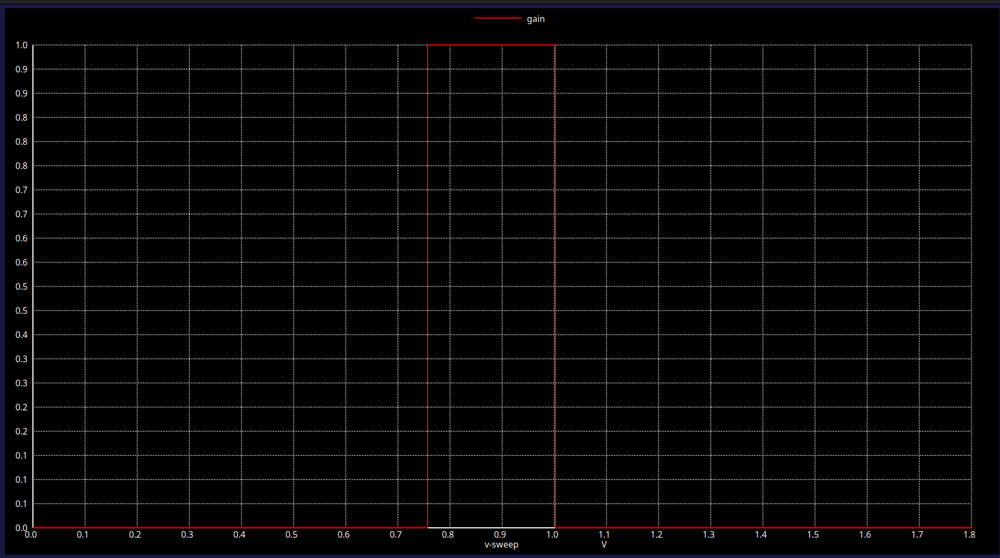
</p>

Simulation Window(left) and Entire Graph (right):

<p align="center">
  
  
</p>


From the analysis, we get the following values:
| Name             | Value                                                                |
| ----------------- | ------------------------------------------------------------------ |
| `Vth`|  `0.882V`  |
| `VIL` |   `0.756V` |
| `VIH` | `1.001V` |
| `VOL` | `0.069V` |
| `VOH` | `1.747V` |


Hence the calculated Noise Margins are:

**NML = 0.687V** and **NMH = 0.746**.

 Now, they aren't equal. But if we were to take some more effort to get the values of Vth closet to Vdd/2 (0.9V), then we can get NML = NMH. But for our case they are close enough.

---
 ### CMOS Delay Analysis

 Delay analysis in CMOS circuits helps determine how fast a circuit can operate and how quickly signals propagate through it.  
It is critical in **digital design** to ensure **timing correctness** and **reliable performance**.

####  Key Delay Components
1. **Propagation Delay (`t_pd`)**  
   Time taken for the output to switch after an input change.
   
2. **Rise Time (`t_r`)**  
   Time for output to go from 10% → 90% of final value.
   
3. **Fall Time (`t_f`)**  
   Time for output to go from 90% → 10% of final value.

#### Factors Affecting Delay
- **Load Capacitance (`C_L`)** – Larger loads cause higher delay.
- **Transistor Sizes** – Wider transistors can reduce delay.
- **Supply Voltage (`Vdd`)** – Higher voltage generally reduces delay.
- **Process Technology** – Smaller nodes usually offer faster switching.

#### Delay Parameters in CMOS Circuits

Below are the key delay parameters observed during CMOS circuit timing analysis.

#### **1. tpHL (High-to-Low Propagation Delay)**
- **Definition:** Time taken for the output to transition from **logic high (1)** to **logic low (0)** after the corresponding change in input.

#### **2. tpLH (Low-to-High Propagation Delay)**
- **Definition:** Time taken for the output to transition from **logic low (0)** to **logic high (1)** after the corresponding change in input.

#### **3. Propagation Delay (t_pd)**
- **Definition:** The **average delay** of `tpHL` and `tpLH`, representing the overall switching speed of the circuit.
<p align="center">
t_pd = (tpHL + tpLH) / 2 
</p>

#### **4. Rise Time (t_r)**
- **Definition:** Time for the output voltage to rise from **10%** of its final high value to **90%** of its final high value.
- **Significance:** Indicates how quickly the signal can charge up to logic high.

#### **5. Fall Time (t_f)**
- **Definition:** Time for the output voltage to fall from **90%** of its initial high value to **10%** of its final low value.
- **Significance:** Indicates how quickly the signal can discharge to logic low.


<p align="center">
  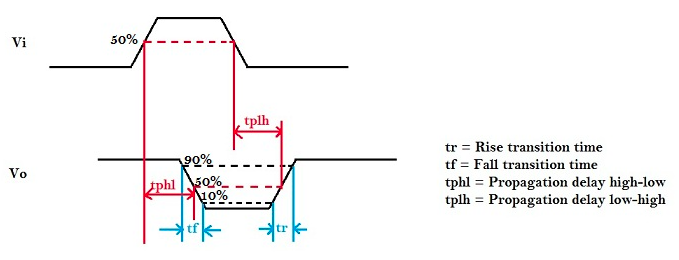
</p>


Now from the analysis that has been done:

**Test-Bench:**
<p align="center">
  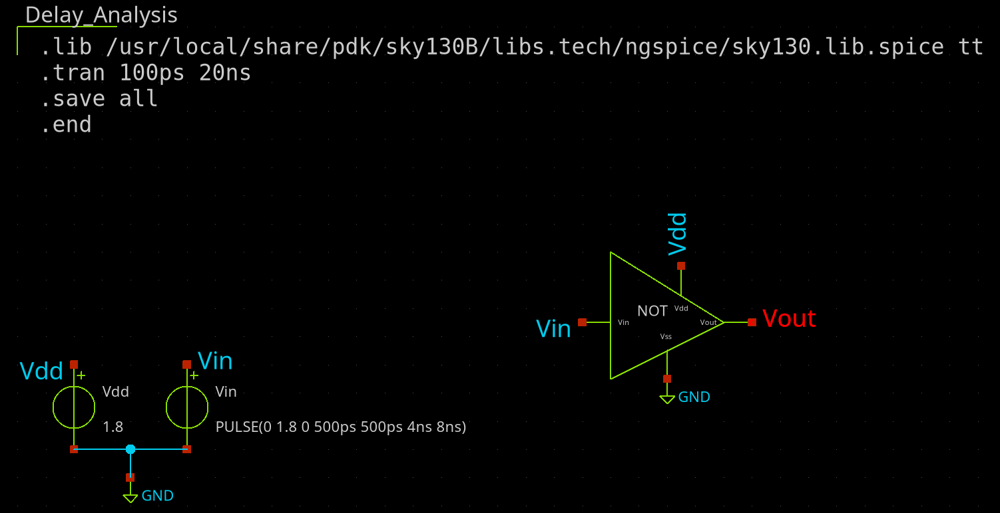
</p>

**Simulated Graph:**

<p align="center">
  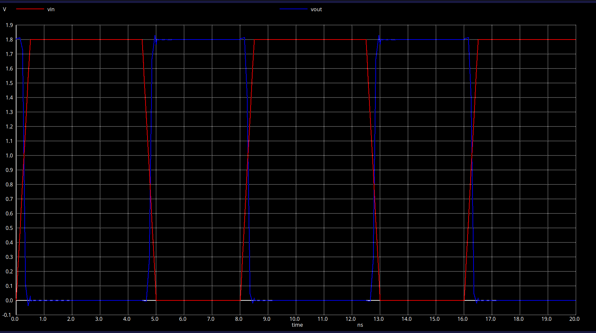
</p>


**tpHL and tpLH:**

<p align="center">
  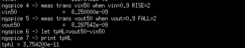
</p>
<p align="center">
  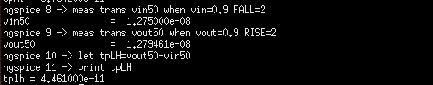
</p>

**Rise Time and Fall Time:**

<p align="center">
  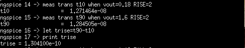
</p>
<p align="center">
  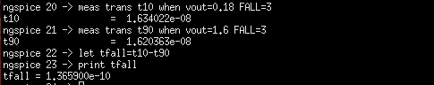
</p>

Hence, the summary of the delay analysis is:

| Name             | Value                                                                |
| ----------------- | ------------------------------------------------------------------ |
| `tpHL`|  `37.542 ps`  |
| `tpLH`|   `44.61 ps` |
| `t_pd`| `41.07 ps`|
| `t_r` | `0.13 ns` |
| `t_f` | `0.136 ns` |

---
### CMOS Power Analysis
Power analysis in CMOS circuits helps determine the energy efficiency and thermal performance of a design.  
It is crucial for **low-power VLSI design**, especially in portable and high-performance applications.


#### **1. Types of Power Consumption**

#### 🔹 Dynamic Power
- Caused by switching activity when charging and discharging load capacitances.
- Formula:
  
  **P_dynamic = α × C_L × V_DD² × f**
  
  Where:  
  - α → Switching activity factor (0 ≤ α ≤ 1)  
  - C_L → Load capacitance  
  - V_DD → Supply voltage  
  - f → Operating frequency  


#### 🔹 Short-Circuit Power
- Occurs during signal transitions when both PMOS and NMOS conduct simultaneously.
- Formula:
  
  **P_sc ≈ I_sc × V_DD × t_sc × f**
  
  Where:  
  - I_sc → Short-circuit current  
  - t_sc → Short-circuit time per transition  
  - f → Operating frequency  


#### 🔹 Static (Leakage) Power
- Caused by subthreshold leakage, gate leakage, and junction leakage even when the circuit is idle.
- Formula:
  
  **P_static = I_leak × V_DD**
  
  Where:  
  - I_leak → Total leakage current  
  - V_DD → Supply voltage  


#### **2. Importance**
- Reduces **heat dissipation**.  
- Extends **battery life** in portable devices.  
- Improves **overall system reliability**.


In the analysis process, a load capacitance has been considered. This is done to measure the loaded power of the inverter. Following shows the detailed setup and analysis result from the power analysis:

**Test-Bench:**
<p align="center">
  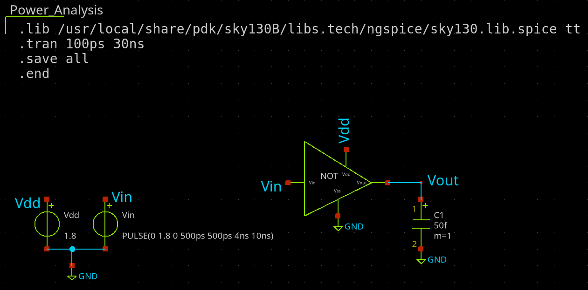
</p>

**Simulated Graph and Result:**
<p align="center">
  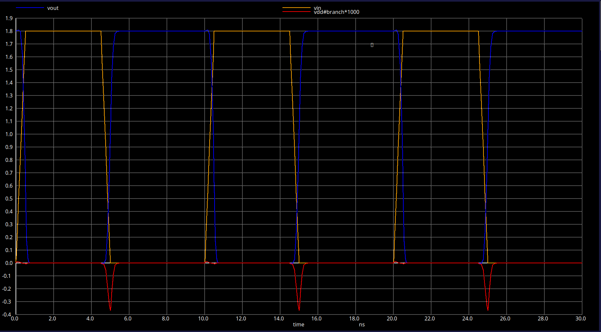
</p>


As, it can be seen from the graph that there is a flowing of current only when the load capacitor is being charged .i.e. the current flowing from the Vdd to the load capacitor. Also it is to be considered that as the fets are not ideal, there exists a time when both the fets are on which causes short-circuit causing the current to flow from vdd directly to the ground. Hence the surge of current that is shown in the graph is from both dynamic+short-circuit current.


<p align="center">
  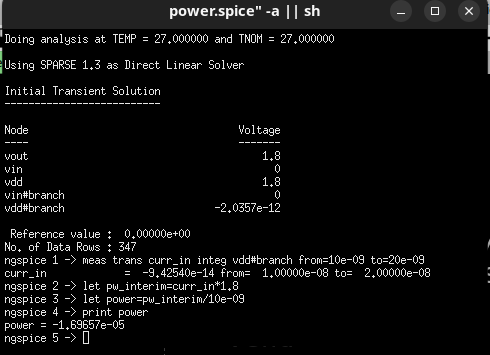
</p>


Fromt the calculation above, the loaded power consumed by the inverter is about **17uW**. This power is consued at every switching operation. As a result, to reduce the power consumption in larger circuits minimisation in the switching activity is to be done. Further, reduction of the load capacitance can also be useful in this scenario.

---
## Summary from Pre-Layout Analysis:
As the Pre-Layout Analysis of the inverter is done, I will be stepping into the layout analysis of the inverter with LVS at the end. However Before Entering into the later part, below table shows the calculated values and features from the Pre-Layout analysis:

<div align="center">

| **Parameter** | **Value** |
|--------------|-----------|
| **Cells Used** | Standard `1.8V` `nfet` and `pfet` |
| **Vth** | `0.882 V` |
| **VIL** | `0.756 V` |
| **VIH** | `1.001 V` |
| **VOL** | `0.069 V` |
| **VOH** | `1.747 V` |
| **NML** | `0.687 V` |
| **NMH** | `0.746 V` |
| **tpHL** | `37.542 ps` |
| **tpLH** | `44.61 ps` |
| **t_pd** | `41.07 ps` |
| **t_r** | `0.13 ns` |
| **t_f** | `0.136 ns` |
| **Power** | `17 µW` |

</div>


##
